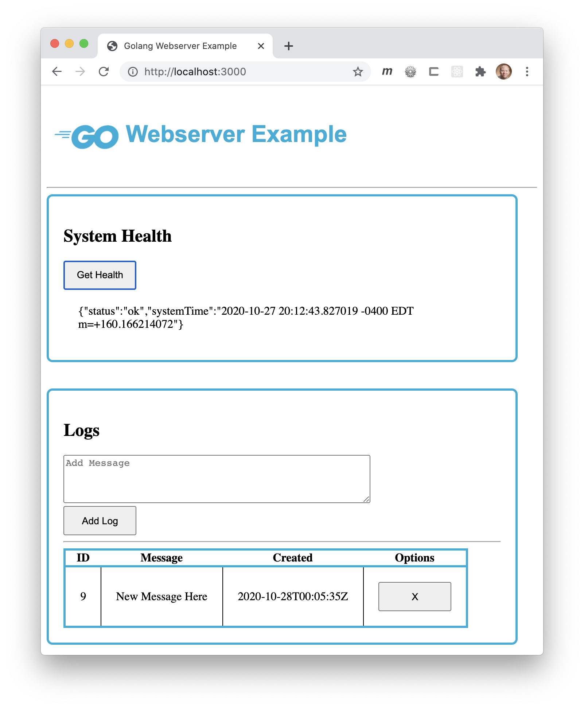

# Webserver Example In Go
In this example there are many great aspects of a web application and server in Go. 
1. Static serving of web pages.
1. JSON marshalling and unmarshalling.
1. Go handlers for endpoints.
## Health
This example shows making a fetch request to a GET endpoint in Go to get back JSON about the health of the system.

## Log
In this example we post data to Go and write that data to a file. 
1. Post to server and store in sqlite.
2. Pull all logs from sqlite and return as json.
3. Create delete method removing log entry from database.

